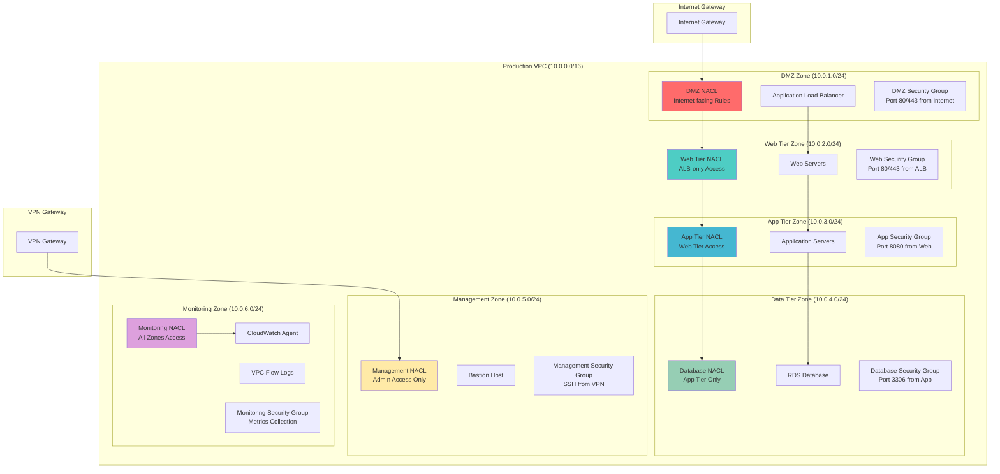

# Securing Networks with Micro-Segmentation using NACLs and Security Groups

## Problem

Enterprise organizations must implement granular network security controls to prevent lateral movement of threats and ensure compliance with regulatory frameworks like PCI DSS, HIPAA, and SOC 2. Traditional network security approaches often rely on perimeter-based defenses that allow broad access within the network, creating security vulnerabilities when an attacker gains initial access. Modern enterprise applications require fine-grained network segmentation that isolates different tiers, environments, and data classification levels while maintaining operational efficiency and application performance.

## Solution

This solution implements a comprehensive micro-segmentation strategy using Network Access Control Lists (NACLs) for subnet-level enforcement and advanced security group configurations for instance-level controls. The architecture creates multiple security zones with layered defenses, automated traffic monitoring, and zero-trust networking principles that ensure every network connection is explicitly authorized and continuously validated.

## Architecture Diagram

## Prerequisites

1. AWS account with appropriate permissions for VPC, EC2, RDS, CloudWatch, and IAM operations
2. AWS CLI v2 installed and configured (or AWS CloudShell)
3. Understanding of network security principles, CIDR blocks, and multi-tier architectures
4. Familiarity with security group and NACL rule precedence and evaluation order
5. Estimated cost: $200-300/month for EC2 instances, RDS, and CloudWatch monitoring

> **Note**: This recipe demonstrates advanced security concepts. Test thoroughly in a non-production environment before implementing in production workloads.
